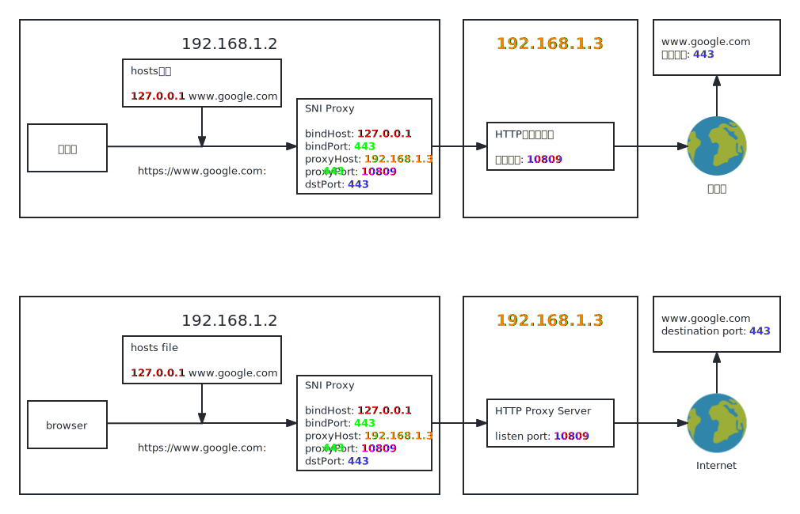

# SNI代理 SNI Proxy

你可以将`HTTPS`连接透明的转发到`SOCKS/HTTP`代理服务器，用于一些无法手动设置代理的软件或游戏。

For some software or games that cannot be set proxy manually, you can forward `HTTPS` connections to `SOCKS/HTTP` proxy servers transparently.

## 功能 Features

1. * 支持传入`HTTPS`协议
   * Support incoming `HTTPS` protocol
2. * 支持上游`SOCKS/HTTP`代理服务器
   * Support upstream `SOCKS/HTTP` proxy servers
3. * 传入的域名不会被解析，域名将传递给代理服务器处理
   * The incoming domain will not be resolved, it will be passed to the proxy server
4. * 支持同时监听多个端口
   * Support multiple listening ports
   
## 环境 Environment

Java 8

## 用法 Usage

1. * 在`SNIProxy.jar`同一文件夹下创建配置文件`SNIProxy.json`。
   * Create a configuration file `SNIProxy.json` in the same directory as `SNIProxy.jar`.

```json5
{
    // 用于解析TLS头部的缓冲区大小
    // buffer size for parsing TLS header
    "headBufferSize": 8192,
    
    // 用于转发的缓冲区大小
    // buffer size for forwarding
    "forwarderBufferSize": 8192,
    
    // 多个SNI代理
    // Multi SNI Proxies
    "servers": [
        {
        
            // 上游代理类型，可用的有 "socks" | "http"
            // upstream proxy type, available are "socks" | "http"
            "proxyType": "http",
            
            // 上游代理服务器，填写ip或域名
            // upstream proxy server, ip or domain
            "proxyHost": "192.168.1.3",
            
            // 上游代理服务器端口
            // upstream proxy server's port
            "proxyPort": 10809,
            
            // SNI代理绑定的ip
            // SNI Proxy bind ip
            "bindHost": "127.0.0.1",
            
            // SNI代理绑定的端口
            // SNI Proxy bind port
            "bindPort": 443,
            
            // 目标端口，具体可以看下图
            // destination port, see the picture below for details
            "dstPort": 443
        }
    ]
}
```

<picture>
  <source media="(prefers-color-scheme: light)" srcset="./example_light.svg">
  <source media="(prefers-color-scheme: dark)" srcset="./example_dark.svg">
  
</picture>

2. * 运行命令 run command:

```cmd
java -jar SNIProxy.jar
```

## 注意 Notice

不当的配置可能会引起循环代理而耗尽系统资源

Improper configuration can cause looping proxy and drain system resources
